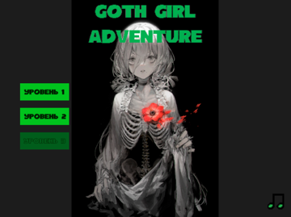
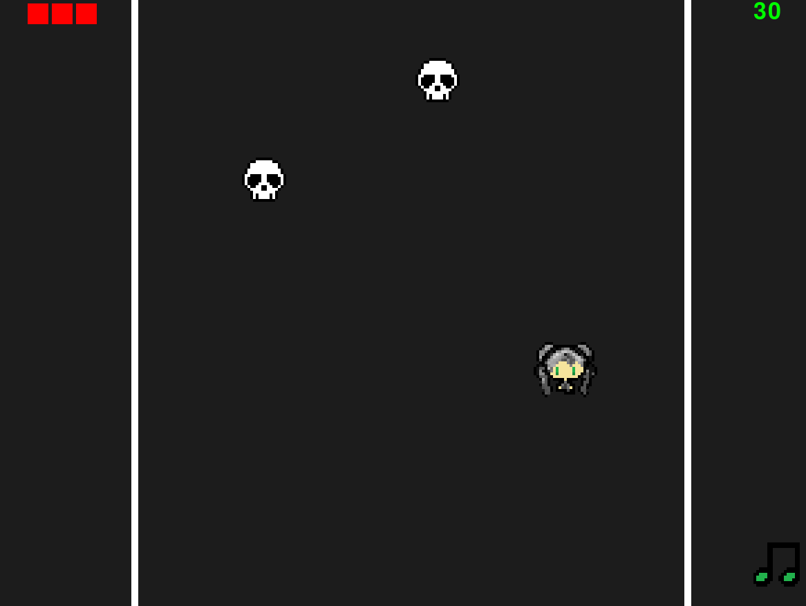
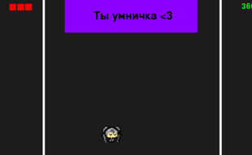

# Bullet_hell_game
Одиночная игра в жанре буллет хелл в стиле готического сюрреализма. 

Авторы: Альмухаметов Тимур, Волчанская Виктория

Мы хотели создать игру в жанре буллет хелл с девочкой-готкой с пепельными волосами, которая отстреливается от скелетов сигаретами. 

Игра создавалась с помощью библиотеки pygame. 
В игре использовалось огромное множество различных классов.
Самые основные из них - класс girl, который изначально представляет собой просто спрайт, но мы прописали для него возможность стрелять, двигаться и терять хп при взаимодействии с противниками.
Противники представляют собой тоже отдельный класс - изначально спрайт, но мы заставили их двигаться сверху вниз на девочку. 
А также сделали более крутого скелета, который тоже представляет из себя отдельный класс спрайта, но в отличие от обычного скелета умирает с двух выстрелов и издает другой звук.
Есть несколько уровней. Сложность уровней растет от начального к конечному. 
Сначала игроку доступен только один уровень, но по мере прохождения ему открываются 2 других.
Присутствует система базы данных, в которую записывается информация о том, что игрок прошел уровень.

Необходимые библиотеки для запуска:
pip        22.2.2
pygame     2.1.2
PyQt5      5.15.7
PyQt5-Qt5  5.15.2
PyQt5-sip  12.11.0
setuptools 63.2.0

